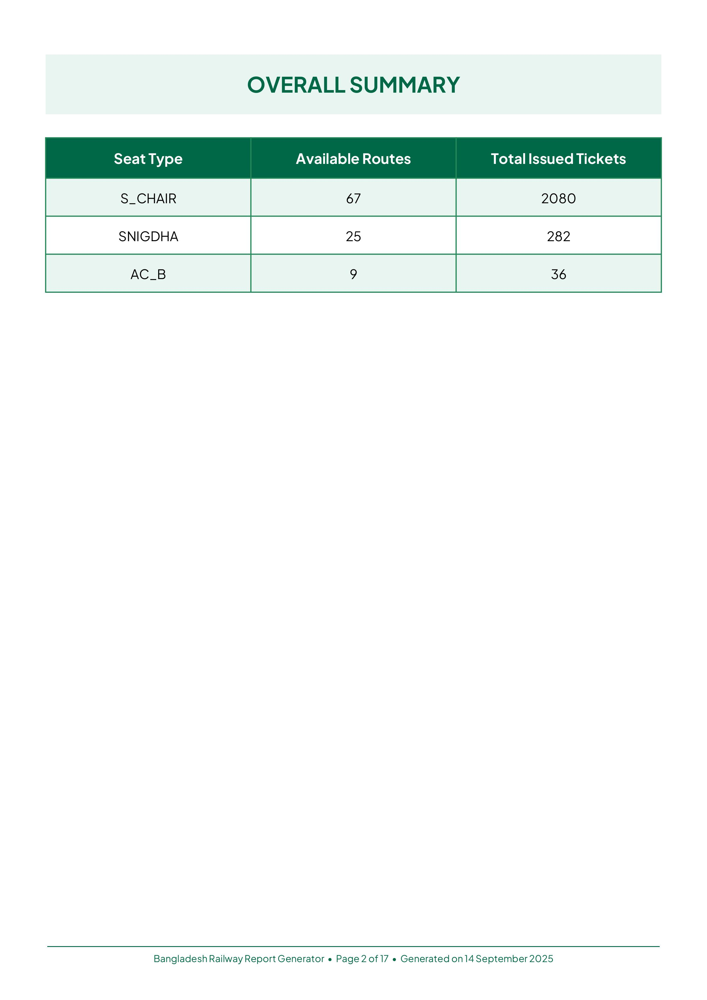

# 🚆 Bangladesh Railway Train Report Generator

A comprehensive web application to **generate detailed PDF reports** for Bangladesh Railway trains. This application provides **train information, route data, schedules, and downloadable reports** — built using Flask, ReportLab, and REST APIs.

<p align="center">
  
  
  
  
</p>

✨ **Key Features:**
- 📋 **PDF Report Generation**: Create comprehensive train reports with detailed information
- � **Train Search by Route**: Find trains between any two stations
- 🚄 **Complete Train Database**: All 120+ Bangladesh Railway trains supported
- 📊 **Detailed Train Information**: Schedules, routes, classes, and timing data
- 📱 **Mobile-Optimized Interface**: Fully responsive design for all devices
- ⚡ **Zero Authentication Required**: No login needed for basic functionality
- ⏳ **Queue System**: Intelligent request management to prevent API overload
- 📄 **Downloadable Reports**: High-quality PDF reports with professional formatting

---

## 🌐 Live Site

👉 **Live URL:** [trainreport.onrender.com](https://trainreport.onrender.com)  
⚠️ **Note:** First load may be delayed up to 1 minute due to free-tier cold starts.

---

## 📚 Table of Contents

1. [Project Structure](#-project-structure)  
2. [Features Overview](#️-features-overview)  
3. [Core Logic](#-core-logic)  
4. [Report Generation](#-report-generation)  
5. [Frontend Features](#️-frontend-features)  
6. [Queue Management](#-queue-management)  
7. [API Integration](#-api-integration)  
8. [Cache Control](#-cache-control)  
9. [Technologies Used](#-technologies-used)  
10. [Setup Instructions](#-setup-instructions)  
11. [Configuration](#️-configuration)  
12. [License](#-license)

---

## 📂 Project Structure
```
.
├── app.py                        # Flask backend with routes, report generation & queue management
├── config.json                   # Dynamic config: maintenance, queue settings, app version
├── reportGenerator.py            # Core PDF report generation with ReportLab integration
├── request_queue.py              # Advanced queue system for managing concurrent requests
├── stations_en.json              # Complete list of Bangladesh Railway stations
├── trains_en.json                # Complete list of 120+ Bangladesh Railway trains
├── LICENSE                       # Project license
├── Procfile                      # Heroku/Render deployment configuration
├── README.md                     # Project documentation (this file)
├── requirements.txt              # Python dependencies
├── images/
│   ├── link_share_image.png      # Social sharing preview image
│   ├── Screenshot_1.jpg          # Interface screenshots
│   ├── Screenshot_2.jpg          # Report generation screenshots
│   ├── Screenshot_3.jpg          # Search interface screenshots
│   └── Screenshot_4.jpg          # PDF report examples
├── static/
│   ├── css/
│   │   └── styles.css            # Responsive UI with report interface styling
│   ├── fonts/
│   │   ├── PlusJakartaSans-Bold.ttf      # Custom font for UI
│   │   └── PlusJakartaSans-Regular.ttf   # Custom font for UI
│   ├── images/
│   │   └── sample_banner.png     # Default banner image
│   └── js/
│       └── script.js             # Frontend logic, validations, train search
└── templates/
    ├── 404.html                  # Custom error page with auto-redirect
    ├── index.html                # Home form with train selection
    ├── notice.html               # Maintenance mode page
    ├── queue.html                # Queue status tracking page
    └── report.html               # Report generation interface
```

---

## ⚙️ Features Overview

| Feature                                  | Status ✅ | Description |
|------------------------------------------|-----------|-------------|
| PDF Report Generation                    | ✅        | Comprehensive train reports with ReportLab integration |
| Train Search by Route                    | ✅        | Find trains between any two stations |
| Detailed Train Information               | ✅        | Complete train data including schedules and routes |
| Real-time API Integration               | ✅        | Live data from Bangladesh Railway systems |
| Professional PDF Formatting             | ✅        | High-quality reports with tables and styling |
| Advanced Queue Management               | ✅        | Prevents API overload with intelligent queuing |
| Responsive Web Interface               | ✅        | Mobile-optimized design for all devices |
| Train Route Visualization              | ✅        | Complete route maps with station information |
| Downloadable Reports                   | ✅        | PDF download functionality with file management |
| Maintenance Mode Support               | ✅        | Configurable site-wide notices |
| Session-based Form State              | ✅        | Preserves user input across requests |
| Custom Error Handling                 | ✅        | Graceful fallbacks for API failures |
| Social Media Integration              | ✅        | Open Graph tags for sharing |
| Cache-Control Headers                 | ✅        | Ensures fresh data on every request |
| User Activity Logging                 | ✅        | Comprehensive logging of user interactions and system events |
| PDF File Management                   | ✅        | Automatic cleanup of generated reports |

---

## 🧠 Core Logic

### 🚂 Report Generation System

The heart of the application lies in `reportGenerator.py`, which implements:

```python
def generate_report(train_data: dict, train_name: str, report_type: str = "comprehensive") -> str
```

**Process Flow:**
1. **Train Data Fetching**: Gets complete train information from API
2. **PDF Document Creation**: Uses ReportLab for professional formatting
3. **Content Structuring**: Organizes data into tables and sections
4. **File Management**: Handles PDF storage and cleanup

### 🔄 Train Search Algorithm

Intelligent train discovery system:

#### 1. Station-to-Station Search
```python
# Finds all trains between two stations
def search_trains_between_stations(origin: str, destination: str) -> list
```

#### 2. Route Analysis
```python
# Analyzes train routes for station coverage
def analyze_train_routes(train_list: list, origin: str, destination: str) -> dict
```

#### 3. Schedule Processing
```python
# Processes train schedules and timing information
def process_train_schedules(train_data: dict) -> dict
```

### 📊 Data Processing

Supports comprehensive train information:
- **Train Details** (Name, Number, Type)
- **Route Information** (Stations, Distances, Timing)
- **Schedule Data** (Departure/Arrival Times)
- **Class Information** (Available seat types)
- **Fare Structure** (Pricing by class and route)

---

## 📄 Report Generation

### PDF Creation with ReportLab
```python
from reportlab.platypus import SimpleDocTemplate, Paragraph, Table, TableStyle
from reportlab.lib.styles import getSampleStyleSheet
from reportlab.lib import colors
```

### Report Structure
- **Header Section**: Train name, number, and basic information
- **Route Table**: Complete station list with distances and timing
- **Schedule Information**: Departure and arrival times
- **Class Details**: Available seat types and configurations
- **Additional Information**: Notes, exceptions, and service details

### PDF Features
- **Professional Formatting**: Clean, readable layout
- **Table Styling**: Color-coded headers and alternating row colors
- **Custom Fonts**: Embedded fonts for consistent appearance
- **Page Management**: Automatic page breaks and headers
- **File Optimization**: Compressed PDFs for faster download

### File Management
```python
# Automatic cleanup of old PDF files
def cleanup_old_pdfs(max_age_hours: int = 24):
    # Removes PDFs older than specified time
```

---

## 🎨 Frontend Features

### 1. Advanced Train Selection
- **Autocomplete Dropdown**: 120+ trains with fuzzy search
- **Model Extraction**: Automatically extracts train numbers from names
- **Validation**: Ensures valid train selection before submission
- **Train Search by Route**: Find trains between specific stations

### 2. Report Interface
- **Progress Tracking**: Real-time status updates during report generation
- **Download Management**: Direct PDF download with file management
- **Preview Options**: Quick view of report contents before download

### 3. Train Search Feature
- **Station Autocomplete**: Smart dropdown with station name suggestions
- **Bidirectional Search**: Swap origin/destination with single click
- **Live Train Discovery**: Real-time API calls to find available trains
- **Results Display**: Formatted train list with route information

### 4. Mobile Optimization
- **Responsive Design**: Optimized for all screen sizes
- **Touch-friendly Controls**: Large tap targets for mobile interaction
- **Fast Loading**: Optimized assets and efficient API calls

### 5. User Interface
```javascript
// Dynamic form validation
function validateTrainSelection() {
    // Ensures proper train selection before report generation
}

// Report generation progress
function updateProgressStatus(status) {
    // Real-time updates during PDF creation
}
```

---

## ⏳ Queue Management

### Advanced Request Queue (`request_queue.py`)

**Features:**
- **Concurrent Limiting**: Configurable max concurrent requests
- **Cooldown Periods**: Prevents API flooding
- **Request Prioritization**: FIFO with abandonment detection
- **Health Monitoring**: Tracks processing times and success rates
- **Auto-cleanup**: Removes stale requests and results

**Configuration:**
```json
{
    "queue_max_concurrent": 1,
    "queue_cooldown_period": 3,
    "queue_batch_cleanup_threshold": 10,
    "queue_cleanup_interval": 30,
    "queue_heartbeat_timeout": 60
}
```

**Process Flow:**
1. Request submitted → Added to queue
2. Queue position displayed to user
3. Request processed when slot available
4. Results cached and delivered
5. Automatic cleanup of completed requests

---

## 🔌 API Integration

### Bangladesh Railway API Endpoints

#### 1. Train Information Data
```http
GET https://railspaapi.shohoz.com/v1.0/web/train-info
Params: train_model, train_name
```

#### 2. Train Route Data
```http
POST https://railspaapi.shohoz.com/v1.0/web/train-routes
Content-Type: application/json
{
    "model": "TRAIN_MODEL",
    "departure_date_time": "YYYY-MM-DD"
}
```

#### 3. Train Search Between Stations
```http
POST /search_trains
Content-Type: application/json
{
    "origin": "STATION_NAME",
    "destination": "STATION_NAME"
}
```

#### 4. Report Generation
```http
POST /generate_report_api
Content-Type: application/json
{
    "train_name": "TRAIN_NAME",
    "report_type": "comprehensive"
}
```

### Error Handling
- **Network Timeouts**: 30-second request timeout
- **Rate Limiting**: Built-in cooldown mechanisms
- **Fallback Responses**: Graceful degradation on API failures
- **Retry Logic**: Automatic retries for transient failures

---

## 🚦 Cache Control

All responses include strict cache headers:
```http
Cache-Control: no-store, no-cache, must-revalidate, max-age=0
Pragma: no-cache
Expires: 0
```

**Benefits:**
- Always fresh data from APIs
- No stale seat availability information
- Proper handling of dynamic content
- Prevents browser caching issues

---

## 🧰 Technologies Used

### Backend
- **Python 3.10+**
- **Flask 3.1.0** - Web framework
- **ReportLab 4.0.4** - PDF generation library
- **requests 2.32.3** - HTTP client for API calls
- **pytz 2025.2** - Timezone handling for BST
- **python-dotenv 1.0.1** - Environment variable management
- **colorama 0.4.6** - Terminal color output
- **gunicorn 23.0.0** - WSGI server for production deployment
- **Structured Logging** - INFO level logging with timestamp and user activity tracking

### Frontend
- **HTML5** with semantic markup
- **CSS3** with Flexbox and Grid
- **Vanilla JavaScript** - No external dependencies
- **Font Awesome 6.4.0** - Icon library
- **Responsive Design** - Mobile-first approach
- **Custom Fonts** - Plus Jakarta Sans font family

### PDF Generation
- **ReportLab** - Professional PDF creation
- **Table Styling** - Advanced table formatting
- **Custom Typography** - Embedded fonts and styling
- **Page Management** - Automatic pagination and headers

### Data Processing
- **Concurrent Programming** - ThreadPoolExecutor for API calls
- **JSON Processing** - Native Python JSON handling
- **Date/Time Handling** - pytz for timezone awareness
- **File Management** - Automatic cleanup and organization

---

## 🧪 Setup Instructions

### 1. Clone Repository
```bash
git clone https://github.com/nishatrhythm/Bangladesh-Railway-Train-Report-Generator.git
cd Bangladesh-Railway-Train-Report-Generator
```

### 2. Install Dependencies
```bash
pip install -r requirements.txt
```

### 3. Environment Configuration
Create a `.env` file in the root directory:
```env
FIXED_MOBILE_NUMBER=your_mobile_number
FIXED_PASSWORD=your_password
```

### 4. Configure Application
Edit `config.json` for customization:
```json
{
    "version": "1.0.0",
    "is_maintenance": 0,
    "queue_enabled": true,
    "is_banner_enabled": 1
}
```

### 5. Run Application
```bash
python app.py
```

**Production Deployment:**
```bash
# With Gunicorn (recommended for production)
gunicorn app:app --log-level=info --access-logfile=-
```

**Logging Output:**
The application will display structured logs including:
- Timestamp and log level
- Report generation requests with device/browser information
- API request details and response status
- Queue management and processing events
- PDF generation and file management operations
- Error tracking and system health monitoring

### 6. Access Application
Visit `http://localhost:5000` in your browser

---

## ⚙️ Configuration

### Queue Settings
- **max_concurrent**: Number of simultaneous API requests (default: 1)
- **cooldown_period**: Delay between requests in seconds (default: 3)
- **batch_cleanup_threshold**: Trigger cleanup after N completed requests
- **cleanup_interval**: Background cleanup frequency in seconds
- **heartbeat_timeout**: Request timeout in seconds

### Maintenance Mode
```json
{
    "is_maintenance": 1,
    "maintenance_message": "Site is under maintenance..."
}
```

### Banner System
```json
{
    "is_banner_enabled": 1,
    "image_link": "https://example.com/banner.png",
    "force_banner": 0
}
```

---

## 🔧 API Response Format

### Train Information Structure
```json
{
    "train_name": "DHAKA EXPRESS",
    "train_model": "786",
    "route": [
        {
            "station_name": "DHAKA",
            "arrival_time": "00:00",
            "departure_time": "07:45",
            "distance_km": 0
        }
    ],
    "classes": ["S_CHAIR", "SNIGDHA", "AC_B"],
    "additional_info": {
        "off_day": "Friday",
        "note": "Express train service"
    }
}
```

### Report Generation Response
```json
{
    "status": "success",
    "report_id": "unique_report_id",
    "filename": "DHAKA_EXPRESS_report.pdf",
    "download_url": "/download_report/filename.pdf",
    "generated_at": "2025-06-23T10:30:00Z"
}
```

### User Activity Logging

The application implements comprehensive logging to track user interactions and system performance:

**Logging Configuration:**
```python
logging.basicConfig(
    level=logging.INFO,
    format='%(asctime)s - %(levelname)s - %(message)s',
    handlers=[logging.StreamHandler(sys.stdout)]
)
```

**Logged Events:**
- **Train Report Requests**: `Report Generation Request - Train: 'TRAIN_NAME' | Device: TYPE, Browser: BROWSER`
- **Train Search Requests**: `Train Search Request - From: 'ORIGIN', To: 'DESTINATION' | Device: TYPE, Browser: BROWSER`
- **PDF Generation Events**: `PDF Generated - Filename: 'report.pdf', Size: X KB`
- **System Events**: Queue status, API failures, and error handling
- **Production Logs**: Gunicorn access logs with `--log-level=info --access-logfile=-`

**Device & Browser Detection:**
- Automatically detects user device type (Mobile/PC)
- Identifies browser (Chrome, Firefox, Safari, Edge, Opera, IE)
- Logs user agent information for analytics and debugging

---

## 🛡️ Security Features

- **Input Sanitization**: All form inputs validated server-side
- **Session Management**: Secure session handling with Flask
- **XSS Protection**: Proper template escaping
- **CSRF Protection**: Session-based form validation
- **Rate Limiting**: Queue system prevents API abuse

---

## 📱 Mobile Features

- **Responsive Design**: Optimized layouts for all screen sizes
- **Touch Optimization**: Large clickable areas and touch-friendly controls
- **Fast PDF Loading**: Optimized report generation for mobile devices
- **Adaptive Interface**: Single-column layout on small screens
- **Mobile-First CSS**: Progressive enhancement for larger screens
- **Offline Detection**: Network status awareness for better UX

---

## 🎯 Future Enhancements

- [ ] Multi-language support (Bengali/English)
- [ ] Report templates with different layouts
- [ ] Email delivery of generated reports
- [ ] Enhanced PDF formatting options

---

## 🤝 Contributing

1. Fork the repository
2. Create a feature branch (`git checkout -b feature/amazing-feature`)
3. Commit your changes (`git commit -m 'Add amazing feature'`)
4. Push to the branch (`git push origin feature/amazing-feature`)
5. Open a Pull Request

---

## ⚖️ Disclaimer

This application uses **publicly accessible APIs** provided by Bangladesh Railway's official e-ticketing platform. All data is fetched through legitimate REST endpoints without any reverse engineering or unauthorized access.

- **Educational Purpose**: Designed for learning and informational use
- **API Compliance**: Respects rate limits and terms of service
- **No Data Scraping**: Uses official API endpoints only
- **Privacy Focused**: No user data collection or storage
- **PDF Reports**: Generated locally and automatically cleaned up

If requested by the official service provider, access will be adjusted accordingly.

---

## 📄 License

This project is licensed under the MIT License - see the [LICENSE](LICENSE) file for details.

---

## 🙏 Acknowledgments

- **Bangladesh Railway** for providing public API access
- **Shohoz** for the e-ticketing platform integration
- **ReportLab** for excellent PDF generation capabilities
- **Flask Community** for the robust web framework
- **Open Source Community** for inspiration and tools
- **Contributors** who help improve this project

---

<div align="center">

**Made with ❤️ for Bangladesh Railway passengers**

[🌐 Live Demo](https://trainreport.onrender.com) | [📧 Feedback](https://forms.gle/NV72PC1z75sq77tg7) | [⭐ Star on GitHub](https://github.com/nishatrhythm/Bangladesh-Railway-Train-Report-Generator)

</div>