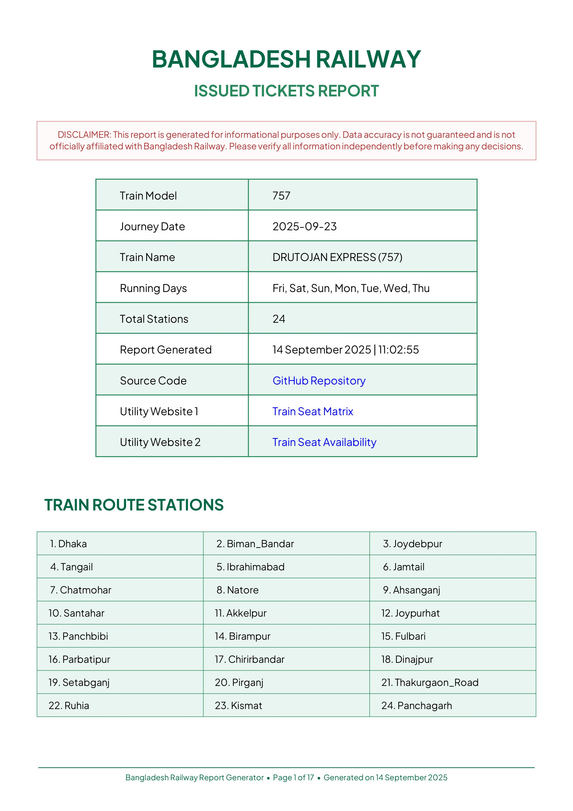
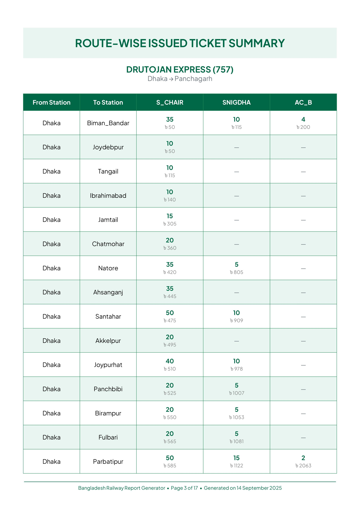
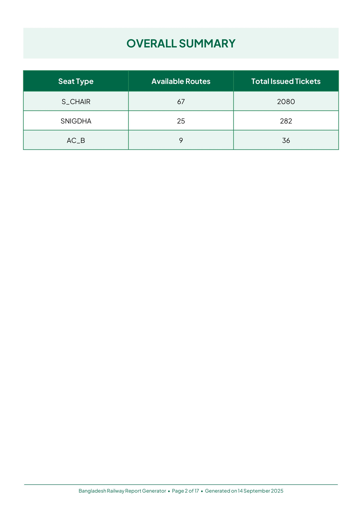
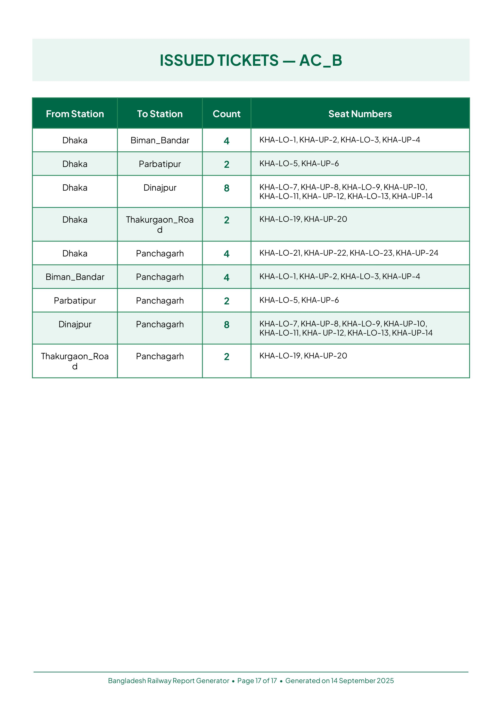

<h1 align="center">Bangladesh Railway Train Report Generator</h1>

This tool helps you generate a detailed report of issued tickets for a specific train in Bangladesh Railway, including a PDF summary. You do not need to be a technical expert to use this tool—just follow the simple steps below!

<p align="center">
  
  
  
  
</p>
<p align="center">
  <b>Sample PDF Report Pages: Summary &rarr; Seat Type & Route Details &rarr; Ticket Matrix</b>
</p>

---

## What Does This Tool Do?
- **Fetches train ticket data** for a specific train and date.
- **Analyzes issued tickets** for all route combinations.
- **Provides a route-wise issued ticket summary** for every station pair.
- **Generates a beautiful PDF report** with all the details, including route-wise analysis.

---

## Folder Structure
```
Bangladesh-Railway-Train-Report-Generator/
.
├── generator.py                    # Main script to run
├── README.md                       # This guide
├── LICENSE                         # License file
├── .env                            # Your configuration (see below)
└── assets/                         # Fonts, sample PDF, and images
    ├── PlusJakartaSans-Bold.ttf
    ├── PlusJakartaSans-Regular.ttf
    ├── sample_report.pdf           # Example of the generated report
    ├── Screenshot_1.jpg            # Sample image from PDF
    ├── Screenshot_2.jpg            # Sample image from PDF
    ├── Screenshot_3.jpg            # Sample image from PDF
    └── Screenshot_4.jpg            # Sample image from PDF
```

---

## Prerequisites
- **Windows PC** (recommended, but works on Mac/Linux too)
- **Python 3.8 or newer** installed ([Download Python](https://www.python.org/downloads/))
- **Internet connection** (to fetch data)

---

## Quick Start Guide

### 1. Download or Clone the Project
- Download the ZIP from GitHub and extract it, or use `git clone` if you know how.

### 2. Open the Project Folder
- Open the folder `Bangladesh-Railway-Train-Report-Generator` on your computer.

### 3. Install Required Packages
- Open **Command Prompt** (press `Win + R`, type `cmd`, press Enter).
- Change directory to the project folder. For example:
  ```powershell
  cd "C:\Users\YourName\Desktop\Bangladesh-Railway-Train-Report-Generator"
  ```
- Run this command to install all required packages:
  ```powershell
  pip install colorama tabulate python-dotenv reportlab requests
  ```

### 4. Configure Your Details
- Open the `.env` file in Notepad or any text editor.
- Update these values:
  - `MOBILE_NUMBER` and `PASSWORD`: Use a **fresh railway account** (no existing bookings for best results).
  - `TRAIN_MODEL`: The train number/model you want to check (e.g., `757`).
  - `DATE_OF_JOURNEY`: The date you want to check (format: `DD-MMM-YYYY`, e.g., `02-Jul-2025`).

#### Sample `.env` file
```
MOBILE_NUMBER=01XXXXXXXXX
PASSWORD=abcd1234
TRAIN_MODEL=757
DATE_OF_JOURNEY=02-Jul-2025
```

### 5. Run the Tool
- In the Command Prompt (in the project folder), run:
  ```powershell
  python generator.py
  ```
- The tool will:
  - Show progress and information in the terminal.
  - Generate a PDF report in the same folder (filename starts with `bdrailway_issued_tickets_report_`).
  - The generated PDF report will look similar to the [sample_report.pdf](assets/sample_report.pdf) found in the `assets` folder. You can open this file to see an example of what your report will look like.

---

## Output Example
- **PDF Report**: Contains summary, route details, and ticket analysis.
- **Terminal Output**: Shows progress, errors (if any), and summary tables.

---

## Credits
- Developed by [nishatrhythm](https://github.com/nishatrhythm)
- Not affiliated with Bangladesh Railway. Data may not be fully accurate—please verify before use.

---

## Useful Links
- [Seat Matrix Website](https://seat.onrender.com)
- [Seat Availability Website](https://trainseat.onrender.com)

---

**Enjoy your train ticket analysis!**